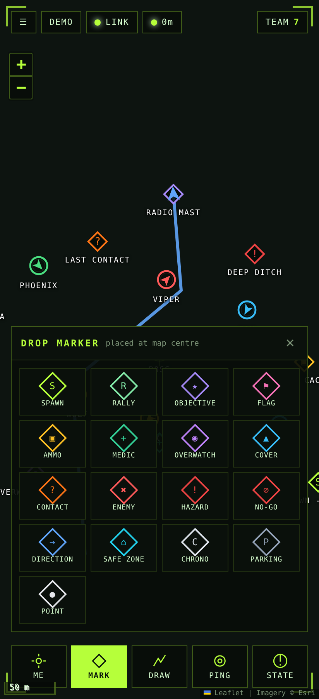
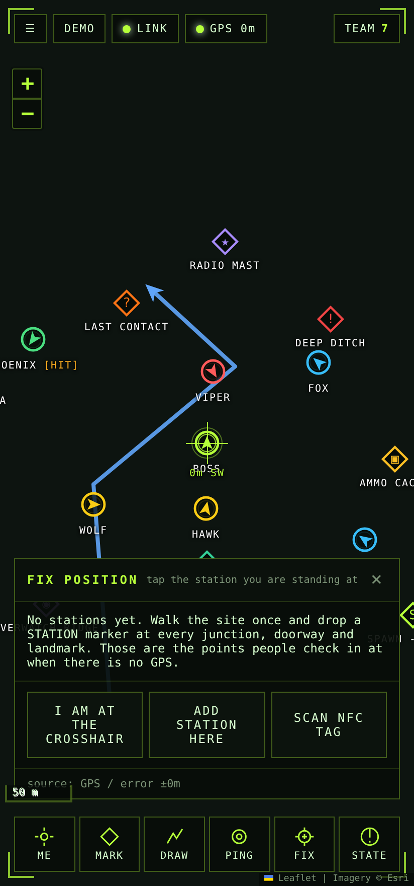
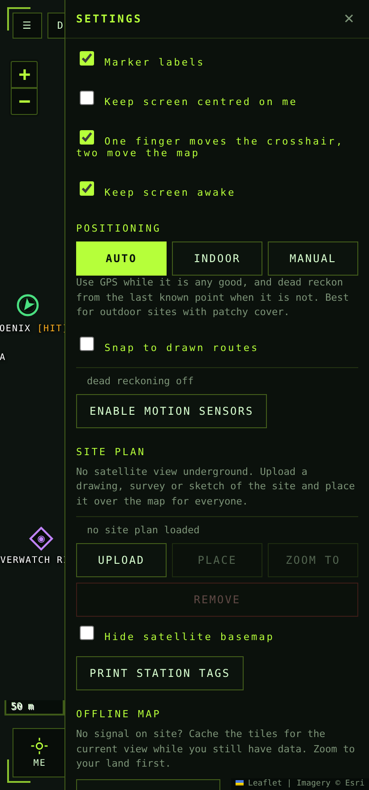

# AirsoftMap

Live team tracking and a shared tactical intel map for airsoft games, built to
be self-hosted on your own site. Open it in a phone browser, join a game code,
and everyone on that code sees each other move in real time.

It also works where GPS does not: indoors, in tunnels, and underground.

<p align="center">
  
  
  
</p>

## What it does

- **Live positions.** Every player's blip shows callsign, team colour and
  heading, with a ring showing how accurate the position actually is. Blips go
  grey when a fix goes stale, so you can tell "he's over there" from "he was
  over there five minutes ago".
- **Shared intel markers.** 18 marker types (spawn, rally, objective, ammo,
  medic, overwatch, cover, contact, enemy, hazard, no-go, direction, safe zone,
  chrono, parking, station...) dropped at the crosshair or by holding a finger
  on the map. Everyone sees them instantly and they persist between games.
- **Drawing.** Lines and arrows for pushes and directions, filled zones for
  objectives, and a dashed boundary for the edge of your land. Each shows its
  length or perimeter as you draw.
- **One-finger crosshair.** On a phone, one finger drags the crosshair and two
  fingers move the map, so you can put a marker exactly on a gate or a treeline
  without your thumb covering the spot. Everything that drops something —
  markers, pings, position fixes — lands under the crosshair.
- **Roster.** Range and compass bearing to every player, last-fix age, battery
  and reported status. Tap a name to jump to them.
- **Status reports.** IN PLAY / HIT / NEED HELP / RESPAWNING, one tap.
- **Map pings.** Ping a spot and everyone's map flashes there.
- **Team-only games.** Optionally lock the game so each team sees only its own
  players and its own intel. Safety and site information stays visible to
  everyone, and marshals see the lot.
- **Terrain.** Contours, hillshade and line-of-sight profiles generated from
  open elevation data, so you can read the shape of ground that imagery shows
  as a flat green blanket.
- **Land parcels.** Load the registered freehold extents for your district, tap
  your plots, and make them the site boundary &mdash; with a warning to anyone
  who wanders off it.
- **Offline maps.** Cache the imagery and elevation for your site before you
  lose signal.
- **Demo mode.** A simulated squad and sample intel, so you can show people what
  it does with no GPS and no other players.

## Running it

```bash
npm install
npm start            # http://localhost:8080
```

Environment variables: `PORT` (default 8080), `HOST` (default 0.0.0.0),
`DATA_DIR` (default `./data`, where markers, drawings and site plans live).

### Getting it on phones

Browsers only give a web page GPS **and** a service worker over HTTPS (or on
`localhost`). Pick whichever fits:

| Setup | Good for |
| --- | --- |
| A VPS or home server behind Caddy/nginx with a real certificate | Public sites, players on mobile data |
| `cloudflared tunnel --url http://localhost:8080` | A quick HTTPS URL with no port forwarding |
| A Raspberry Pi or laptop on site with a battery WiFi router | Sites with no mobile signal at all |

Then send everyone `https://your-host/?room=YOURGAME` — the link pre-fills the
game code. On Android and iOS, "Add to Home Screen" installs it as an app.

## Knowing where your boundary actually is

Owning the land and knowing where it ends are different problems. A title plan
is a picture with no coordinates on it, so on the ground the boundary is
guesswork &mdash; which is how games end up on a neighbour's trees.

**Land parcels.** The registered extent of every freehold title in England and
Wales is open data: HM Land Registry's INSPIRE Index Polygons, published per
local authority under the Open Government Licence. Convert your district and
load it:

```bash
# 1. download your district (no account needed) from
#    https://use-land-property-data.service.gov.uk/datasets/inspire/download
unzip Wealden_District_Council.zip

# 2. cut out the bit you care about and convert it to GeoJSON
node scripts/inspire-to-geojson.js \
  --input Land_Registry_Cadastral_Parcels.gml \
  --centre 50.9550,0.3325 --radius 4000 \
  --out parcels.geojson
```

Then Settings &rarr; LAND PARCELS &rarr; LOAD GEOJSON, pan to your wood, and tap
your plots: the outlines turn green, the area adds up in hectares and acres, and
USE AS SITE BOUNDARY turns them into the boundary everyone in the game sees.

Coordinates are converted from British National Grid with a Helmert transform,
which is good to about 5 m. Two things worth knowing: INSPIRE polygons are
*indicative* extents, not a surveyed boundary; and aerial imagery from different
providers can sit a few metres apart, so a small mismatch between a parcel edge
and a hedge on the photo is normal.

To check them against imagery you trust, convert to KML and open it in Google
Earth or My Maps:

```bash
node scripts/geojson-to-kml.js --input parcels.geojson --out parcels.kml
```

**Boundary warnings.** Once a boundary is drawn &mdash; adopted from a parcel, or
drawn by hand with DRAW &rarr; BOUNDARY &mdash; anyone who steps outside it gets a
warning on their own screen and a buzz in their pocket. Turn it off in Settings
if you would rather not.

## Reading the ground

**Under a canopy, imagery is useless.** Aerial photography of dense woodland is
a green blanket: the stream, the tracks and the boundary banks are all hidden.
For sites in England there is a much better basemap &mdash; the Environment
Agency's 1 m bare-earth LIDAR. It is a survey of the *ground*, with the trees
removed, so gullies, ditches, hollow ways, old field banks and every track show
up clearly. Pick LIDAR under Settings &rarr; BASE MAP. (England only; elsewhere
the contours below are the fallback.)


Satellite imagery of woodland is a green blanket: it says nothing about the
shape of the ground, which is most of what matters when you are deciding where
people can move, see and hold. Tap the height chip in the top bar for:

- **Contour lines** at 2, 5, 10 or 20 m, generated on the phone by marching
  squares over open elevation data (the AWS Terrain Tiles dataset). No contour
  map to source, no files to load.
- **Hillshade**, so a slope reads as a slope through the tree canopy.
- **Line of sight** between where you are standing and the crosshair, with a
  ground profile: whether a position can be seen, and if not, what is in the way
  and how far along.

Elevation tiles are about 30 m resolution &mdash; honest for the shape of the
ground, no substitute for LIDAR. If you have LIDAR for your site, export a
contour or hillshade image from QGIS and load it as a site plan instead. The
elevation tiles are cached by CACHE THIS AREA along with the imagery, so
contours and line of sight keep working with no signal.

## Sites with no signal

Everything below is about the two separate problems a site like a quarry, a
warehouse or a tunnel complex gives you. They are worth keeping apart, because
they have different answers.

### Problem 1: the phones cannot reach each other

Nothing here needs the internet — only that every phone can reach *one server*.
Put that server on site:

- A Raspberry Pi (or any laptop) running `npm start`, plugged into a
  battery-powered WiFi router. Players join the router's WiFi and open the
  server's address. No SIM, no coverage, no cloud.
- WiFi carries a long way down a tunnel — the tunnel acts as a waveguide — but
  will not go through rock or thick walls. Chain a couple of cheap access points
  along the route if you need to cover corners.
- A phone hotspot works for a small group in one area.

The app is built for a link that comes and goes: positions are dropped rather
than queued when the socket is down (a five-minute-old position is a lie, not
data), the connection retries by itself, and the moment it comes back your
current position is pushed again. Markers, drawings and site plans you make
while disconnected are queued and sent when the link returns.

For genuinely huge sites with no line of sight, the honest answer is that WiFi
is not enough and you want a LoRa mesh (Meshtastic and similar) for position
beacons. AirsoftMap does not do that today.

### Problem 2: the phones cannot see satellites

Underground there is no GPS at all, and near buildings there is something worse
than none: a fix that looks confident and is 80 metres out. So the app treats
position as something with a *source* and an *error*, not as a fact.

**Set the mode in Settings → POSITIONING:**

- **AUTO** — GPS while it is any good, dead reckoning from the last known point
  when it is not. For outdoor sites with patchy cover.
- **INDOOR** — ignore GPS completely. For buildings, tunnels and underground.
- **MANUAL** — nothing moves your blip but you.

**A site plan instead of satellite imagery.** Upload a survey drawing, a floor
plan, a hand sketch, or a photo of a whiteboard map (Settings → SITE PLAN),
then scale, rotate and drag it into place. Everyone sees the same placement.
Tick "Hide satellite basemap" and the drawing *is* the map. Scale it by lining
two points on the drawing up with two points you can identify on the ground —
a building corner, a gate, a shaft head.

**Stations: the thing that actually makes this work.** Walk the site once and
drop a STATION marker at every junction, doorway and landmark. Then, in the
game, a player taps FIX and taps the station they are standing at. Their
position snaps there, exactly, with a few metres of error.

Three ways to check in, in order of how fast they are with gloves on:

1. **NFC tag** — stick a cheap NFC sticker at each station and write the URL
   `https://your-host/?room=GAME&fix=CODE` to it. Tap the phone to the tag.
   Works in the dark, one-handed. Android Chrome only.
2. **QR code** — open `/print.html?room=GAME` for a printable sheet of tags,
   one QR per station. Laminate them and cable-tie them up. Scanning one with
   the phone camera drops the player straight onto that station.
3. **Tapping the list** — FIX shows every station sorted by how close it is to
   where the app thinks you are. No hardware at all.

**Dead reckoning between stations.** With motion sensors enabled, the app
counts steps from the accelerometer and points them with the compass. Two
details matter, and they are the two things that usually make step-counting
useless:

- *Step length is not a constant.* A creep and a sprint are not the same
  distance. Each step is sized from how hard it hit the floor — Weinberg's
  estimator, where length scales with the fourth root of the acceleration swing
  — so a hard fast step counts for more than a slow careful one.
- *The constant in that estimator is different for every person.* So it is
  calibrated per player, automatically: walk from one station to another, check
  in at both, and the app knows the true distance and the steps taken between
  them, and corrects your stride. Two check-ins is all it takes, and it keeps
  refining as the game goes on.

Even so, dead reckoning drifts, and the compass is unreliable near steel
(the app warns you when the compass is swinging). So the error is drawn, not
hidden: a dashed circle around your blip that grows by roughly a fifth of the
distance walked since your last real fix, and a `DR ±37m` readout in the HUD
and on the roster. Check in at a station and it collapses back to a few metres.
If the compass gives nothing at all, the blip stays put and only the circle
grows, because "we know he moved but not where" is the truth.

**Snap to drawn routes.** In a tunnel you are *in the tunnel*. Draw the
passages as lines on the site plan and turn on "Snap to drawn routes": a
dead-reckoned position within 25 m of a drawn route is pulled onto it, which
removes most of the sideways drift and leaves only the along-the-tunnel error.

**What to expect.** With stations every 50-80 m and route snapping, a squad's
positions stay good enough to answer "which corridor is he in" all game. Without
stations, expect to be 10-20% of the distance walked out within a few minutes.
That is the physics of the method, not a bug — which is why the app shows you
the error rather than a confident dot.

### Running a game underground: the short version

1. Upload the site plan, place it, and tick "Hide satellite basemap".
2. Drop STATION markers at the junctions. Print `/print.html?room=GAME`,
   laminate, and put a tag at each one.
3. Draw the passages as lines. Turn on "Snap to drawn routes".
4. Cache the map tiles (or none needed if the plan is the basemap — it is
   cached with the app).
5. Players set INDOOR, enable motion sensors, and check in at the entrance.

## Running a game above ground

1. Everyone opens the link, picks a callsign and a team colour, and hits DEPLOY.
2. Before the game, drop your spawns, safe zone, chrono point and the boundary
   of the land. They stay put for future games on the same code.
3. During the game, hold a finger on the map to drop a marker where you are
   pointing, or drag the crosshair and use MARK.
4. Marshals: pick the MARSHAL role — with team lock on, marshals see everyone.

## Testing

```bash
npm test              # all three suites
npm run test:smoke    # two browsers join a game and check they see each other
npm run test:indoor   # station check-ins, dead reckoning, team lock, site plans
npm run test:terrain  # contours, hillshade, line of sight, parcels, boundary
```

The indoor suite drives the step detector with synthetic accelerometer events
and asserts the blip moves a plausible distance in the right direction, that
uncertainty grows, and that a check-in resets it.

Requires Chromium; set `CHROMIUM_PATH` if Playwright's own download is not used.

## How it works

- `server.js` — Express static server plus a WebSocket relay. Game state lives
  in memory; markers, drawings and site plans are written to `data/rooms.json`
  so they survive a restart. No database, no accounts, no tracking.
- `public/js/app.js` — the map, the HUD, and the position engine: everything
  that can say where a player is (satellite fix, station check-in, dead
  reckoned step, hand-placed) funnels through one `setFix` with an honest
  accuracy attached.
- `public/js/pdr.js` — step detection, per-player stride calibration, heading,
  and the drift model.
- `public/js/terrain.js` — elevation tiles, contours by marching squares,
  hillshade, ground profiles and line of sight.
- `public/js/parcels.js` — the registered-parcel layer and adopting plots as the
  site boundary.
- `scripts/inspire-to-geojson.js` — HM Land Registry INSPIRE Index Polygons
  (GML, British National Grid) to GeoJSON.
- `scripts/geojson-to-kml.js` — GeoJSON to KML, for checking a boundary in
  Google Earth.
- `public/js/plan.js` — site plan overlay, scaling, rotation and placement.
- `public/js/net.js` — WebSocket client with reconnect and position replay.
- `public/sw.js` — service worker: caches the app shell, site plans and map
  tiles.

Positions are only ever sent to players sharing your game code, and only while
the page is open.

Imagery &copy; Esri, OpenTopoMap and OpenStreetMap contributors. LIDAR relief
&copy; Environment Agency, Open Government Licence. Elevation from
the [AWS Terrain Tiles](https://registry.opendata.aws/terrain-tiles/) open
dataset. Land parcels from HM Land Registry INSPIRE Index Polygons, &copy; Crown
copyright and database right, under the Open Government Licence v3.0. QR encoding
by [qrcode-generator](https://github.com/kazuhikoarase/qrcode-generator) (MIT).
